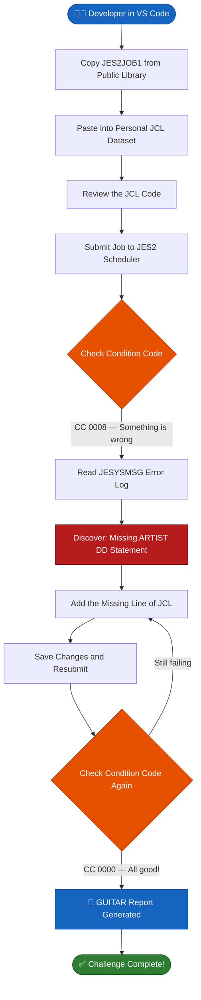
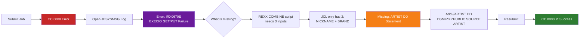
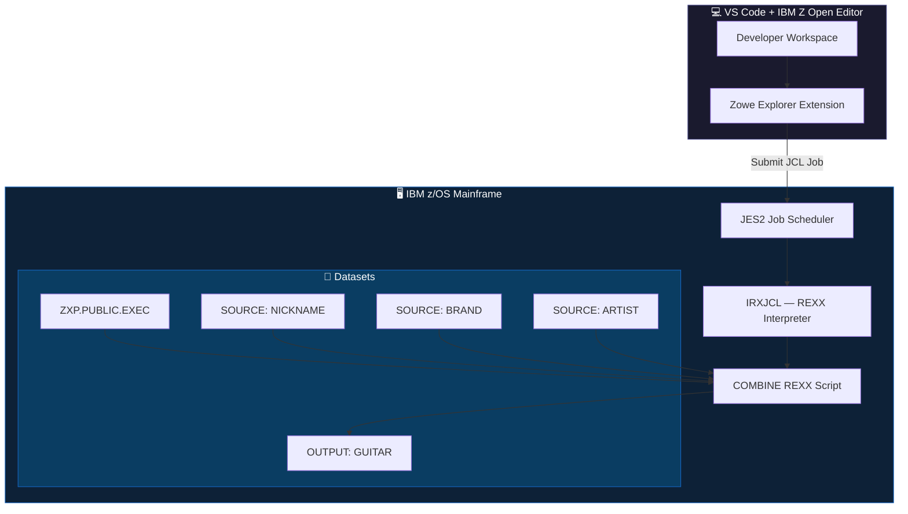
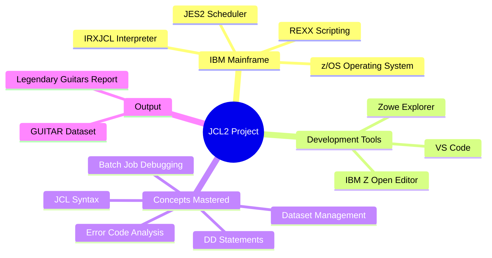

# 🎸 JCL2 — Debugging a Mainframe Job on IBM z/OS
> *Advanced IBM Z Xplore Challenge | JCL Debugging | Mainframe Engineering*

<div align="center">

[](https://ibmzxplore.influitive.com/)
[](https://www.ibm.com/products/zos)
[](https://www.ibm.com/docs/en/zos)
[](https://github.com)
[](https://www.ibm.com)
[](https://code.visualstudio.com/)

</div>

---

## 🤔 What Is This? (Plain English)

> Imagine you have a giant, ultra-reliable computer — so powerful it runs the banking systems, airline reservations, and healthcare networks that billions of people depend on every single day. That computer is an **IBM Mainframe**, and the language used to tell it *what jobs to run and what files to use* is called **JCL (Job Control Language)**.

This project is about **finding and fixing a bug** in a JCL program on a real IBM mainframe (z/OS). The broken program was supposed to combine three data files — guitar nicknames, brand names, and artist names — into one neat report called "Legendary Guitars." But it was missing a critical file instruction, causing it to crash with an error code.

**I found the bug, wrote the fix, and got the job running perfectly — from `CC 0008` (error) to `CC 0000` (success).** ✅

---

## 📺 The Big Picture

```
 ┌─────────────────────────────────────────────────────┐
 │              IBM Mainframe (z/OS)                   │
 │                                                     │
 │  📂 ZXP.PUBLIC.SOURCE                               │
 │     ├── NICKNAME  ──┐                               │
 │     ├── BRAND    ───┼──► COMBINE Program ──► 🎸 GUITAR Report
 │     └── ARTIST   ──┘  (IRXJCL + REXX)              │
 │                                                     │
 │  JES2 Job Scheduler runs everything                 │
 └─────────────────────────────────────────────────────┘
```

---

## 🗺️ How the Job Works — Step by Step



---

## 🔍 The Debugging Process



---

## 🛠️ Technical Specifications

| Property | Value |
|---|---|
| **Platform** | IBM z/OS (Mainframe Operating System) |
| **Job Scheduler** | JES2 (Job Entry Subsystem 2) |
| **Program Executed** | `IRXJCL` — IBM's REXX interpreter for batch jobs |
| **Script Language** | REXX (Restructured Extended Executor) |
| **Parameter** | `PARM='COMBINE'` — triggers the COMBINE REXX routine |
| **IDE / Editor** | Visual Studio Code with IBM Z Open Editor extension |
| **Input Files** | `ZXP.PUBLIC.SOURCE(NICKNAME)`, `(BRAND)`, `(ARTIST)` |
| **Output Dataset** | `<USERID>.OUTPUT(GUITAR)` |
| **Error Before Fix** | `CC 0008` — IRX0670E EXECIO error |
| **Status After Fix** | `CC 0000` — Job completed successfully |
| **Challenge Level** | Advanced (IBM Z Xplore) |
| **Estimated Time** | 45 minutes |

---

## 📄 The JCL Code — Before & After

### ❌ Broken Version (CC 0008)

```jcl
//JES2JOB1 JOB
//COMBINE  EXEC PGM=IRXJCL,PARM='COMBINE'
//SYSEXEC  DD DSN=ZXP.PUBLIC.EXEC,DISP=SHR
//SYSTSPRT DD DSN=&SYSUID..OUTPUT(GUITAR),DISP=SHR
//SYSTSIN  DD DUMMY
//NICKNAME DD DSN=ZXP.PUBLIC.SOURCE(NICKNAME),DISP=SHR
//BRAND    DD DSN=ZXP.PUBLIC.SOURCE(BRAND),DISP=SHR
```
> 🚨 **The ARTIST data file is missing!** The COMBINE program expects three inputs but only two are provided.

---

### ✅ Fixed Version (CC 0000)

```jcl
//JES2JOB1 JOB
//COMBINE  EXEC PGM=IRXJCL,PARM='COMBINE'
//SYSEXEC  DD DSN=ZXP.PUBLIC.EXEC,DISP=SHR
//SYSTSPRT DD DSN=&SYSUID..OUTPUT(GUITAR),DISP=SHR
//SYSTSIN  DD DUMMY
//NICKNAME DD DSN=ZXP.PUBLIC.SOURCE(NICKNAME),DISP=SHR
//BRAND    DD DSN=ZXP.PUBLIC.SOURCE(BRAND),DISP=SHR
//ARTIST   DD DSN=ZXP.PUBLIC.SOURCE(ARTIST),DISP=SHR   ← Added this line
```
> ✅ **One line. That's all it took.** The ARTIST DD statement tells the job where to find the artist names.

---

## 📋 DD Statement Breakdown (What Each Line Does)

> DD = **Data Definition** — it's how you tell the mainframe "here's a file the program needs"

| DD Name | Dataset Location | Purpose |
|---|---|---|
| `SYSEXEC` | `ZXP.PUBLIC.EXEC` | Where the REXX scripts live (the program code) |
| `SYSTSPRT` | `&SYSUID..OUTPUT(GUITAR)` | Where the final output report gets written |
| `SYSTSIN` | `DUMMY` | Placeholder — no interactive input needed |
| `NICKNAME` | `ZXP.PUBLIC.SOURCE(NICKNAME)` | File containing guitar nicknames (Blackie, Lucille, etc.) |
| `BRAND` | `ZXP.PUBLIC.SOURCE(BRAND)` | File containing guitar brand/model names |
| `ARTIST` | `ZXP.PUBLIC.SOURCE(ARTIST)` | ✅ **The missing file** — guitar owners/artists |

---

## 🚦 Understanding Condition Codes (For Non-Tech Folks)

Think of Condition Codes like the **check engine light** in your car:

| Condition Code | Meaning | What It Means in Plain English |
|---|---|---|
| `CC 0000` | ✅ **Success** | Everything ran perfectly, no problems |
| `CC 0004` | ⚠️ **Warning** | Job finished but something was slightly off |
| `CC 0008` | ❌ **Error** | Something went wrong — job may not have worked |
| `CC 0012` | 🚨 **Severe Error** | Serious failure — results cannot be trusted |
| `CC 0016` | 💀 **Critical** | System-level failure, job aborted |

> This job went from `CC 0008` → `CC 0000`. That's a complete fix.

---

## 🎸 The Final Output — Legendary Guitars Report

When the job ran successfully, it generated this report by merging all three data files:

| # | Guitar Nickname | Brand | Artist |
|---|---|---|---|
| 1 | **Blackie** | Fender Strat. (custom) | Eric Clapton |
| 2 | **Cloud** | Custom build | Prince |
| 3 | **Lucille** | Gibson (almost burned) | B.B. King |
| 4 | **Frankenstrat** | Fender/Gibson Frankencaster | Eddie Van Halen |
| 5 | **Monterey Stratocaster** | Fender Strat. Flower Power | Jimi Hendrix |
| 6 | **Concorde** | Jackson Flying V | Randy Rhoads |

> This output was written to the `GUITAR` member inside the personal `OUTPUT` dataset on the mainframe.

---

## 🏗️ System Architecture



---

## 🔐 Security Features of IBM z/OS

This isn't just any computer — the IBM Mainframe is the **most secure production platform in the world**. Here's why enterprises trust it:

| Security Feature | What It Does | Real-World Impact |
|---|---|---|
| **RACF (Resource Access Control)** | Controls exactly who can access which datasets and programs | Banks use this to ensure only authorized staff touch transaction files |
| **Crypto Express Hardware** | On-chip encryption accelerator — keys never leave the hardware | Payment card data is encrypted at the silicon level |
| **Pervasive Encryption** | Encrypts all data at rest and in motion by default | No extra configuration needed — everything is encrypted always |
| **Sysplex Security** | Security policies shared across multiple mainframe systems automatically | A policy change takes effect across all connected systems instantly |
| **SMF Audit Logging** | Every single action is logged with a timestamp and user ID | Perfect for compliance — HIPAA, PCI-DSS, SOX |
| **Workload Isolation** | Jobs run in completely isolated memory spaces | One job crashing cannot corrupt another job's data |
| **DISP=SHR / EXCL** | Fine-grained file access control at the JCL level | Prevents two jobs from writing to the same file simultaneously |

> 💡 *In this project, the `DISP=SHR` parameter on every DD statement ensures the source files are read-only — no accidental overwrites possible.*

---

## 🧰 Tools & Technologies Used



---

## 💡 Key Concepts Explained Simply

<details>
<summary>📦 <strong>What is a Dataset?</strong> (click to expand)</summary>

On a mainframe, files are called **datasets**. They're organized with names like `ZXP.PUBLIC.SOURCE(ARTIST)` — think of it like a folder path: the library is `ZXP.PUBLIC.SOURCE` and the specific file inside it is `ARTIST`. The brackets `()` are how mainframe datasets refer to members inside a library.

</details>

<details>
<summary>⚙️ <strong>What is REXX?</strong> (click to expand)</summary>

**REXX** (Restructured Extended Executor) is a scripting language built into z/OS. The `COMBINE` script written in REXX reads the three input files (NICKNAME, BRAND, ARTIST) and merges them into one formatted report. Think of it as a shell script, but for mainframes — and 40+ years old.

</details>

<details>
<summary>🗂️ <strong>What is JES2?</strong> (click to expand)</summary>

**JES2 (Job Entry Subsystem 2)** is the mainframe's job scheduler. When you submit a JCL job, JES2 queues it, runs it, collects all output (SYSOUT), and stores the results. It's like a highly reliable CI/CD runner — except it was invented in the 1970s and still powers critical infrastructure today.

</details>

<details>
<summary>🔎 <strong>What was the actual error?</strong> (click to expand)</summary>

The error message was:
```
IRX0670E EXECIO error while trying to GET or PUT a record
```
This REXX error means: "I tried to read from or write to a file that doesn't exist (or wasn't defined in the JCL)." The COMBINE script tried to open the ARTIST file, but no DD statement pointed to it — so it crashed. The fix was one line of JCL.

</details>

---

## 📊 Error Resolution at a Glance

| Metric | Before Fix | After Fix |
|---|---|---|
| **Condition Code** | `CC 0008` ❌ | `CC 0000` ✅ |
| **Job Status** | Failed | Completed Successfully |
| **GUITAR Output** | Not generated | Generated ✅ |
| **Error Message** | IRX0670E EXECIO failure | None |
| **DD Statements** | 6 (missing ARTIST) | 7 (complete) |
| **Lines Changed** | — | 1 line added |

---

## 🧠 What This Demonstrates About Me As an Engineer

> This challenge isn't just about adding one line of code. It's about a specific, in-demand mindset.

| Skill Demonstrated | Why It Matters to Your Team |
|---|---|
| **Reading unfamiliar error logs** | I can debug systems I didn't build — critical for on-call and production incidents |
| **Mainframe / JCL fluency** | A rare skill — fewer than 5% of developers can work on z/OS production systems |
| **Understanding batch architecture** | I know how enterprise-grade job schedulers work, not just web APIs |
| **Precision under pressure** | One missing line caused the failure. I found it. Spacing matters on mainframes — and I know that |
| **IBM Z Xplore certified** | Validated by IBM — not self-taught guesswork |
| **End-to-end ownership** | I copied the job, broke it intentionally, debugged it, fixed it, and validated the output |

---

## 🏆 Certification

This project is part of the **IBM Z Xplore Advanced Learning Path** — an IBM-certified program designed to train the next generation of mainframe engineers.

```
╔══════════════════════════════════════════════════════╗
║          IBM Z Xplore — Advanced Badge               ║
║                                                      ║
║  Challenge: JCL2 — Fix JCL and Get That Job Running  ║
║  Level:     Advanced                                 ║
║  Status:    ✅ Completed (CC 0000)                    ║
║  Platform:  IBM z/OS                                 ║
╚══════════════════════════════════════════════════════╝
```

---

## 🗂️ Repository Structure

```
jcl2-mainframe-debug/
│
├── README.md                  ← You are here
├── JCL/
│   ├── JES2JOB1_broken.jcl   ← Original broken JCL (CC 0008)
│   └── JES2JOB1_fixed.jcl    ← Fixed JCL with ARTIST DD (CC 0000)
├── OUTPUT/
│   └── GUITAR.txt             ← Final Legendary Guitars report
└── docs/
    └── JCL2_assignment.pdf    ← Original IBM Z Xplore challenge brief
```

---

## 🤝 Let's Connect

If your team works with mainframes, cloud infrastructure, or backend systems — and you need an engineer who can **own a problem from error log to fix** — I'd love to talk.

[](https://linkedin.com/in/anandsundar96)
[](https://github.com/anandsundar)

---

<div align="center">

*Built with 🖤 on IBM z/OS | IBM Z Xplore Advanced Certification*

*"On a mainframe, one missing line can bring down a job. Finding it is the job."*

</div>
